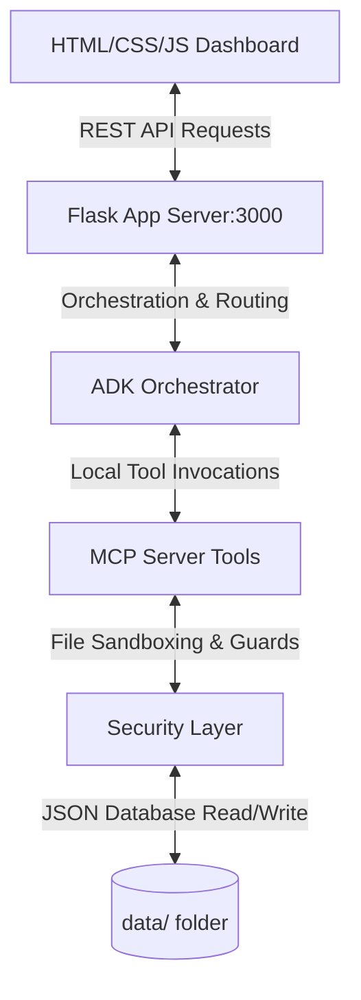

# 🌟 HealthWellness AI - Multi-Agent System & Dashboard

Welcome to **HealthWellness AI**, a secure, state-of-the-art full-stack dashboard designed to manage daily metrics, sleep structures, menstrual cycles, and secure medical records. 

Built using a **Python Flask backend** and a **premium glassmorphic HTML/CSS/JS frontend**, the system utilizes an **ADK (Agent Development Kit) Multi-Agent architecture** communicating with a local **Model Context Protocol (MCP)** server to process health data safely.

---

## 🗺️ System Architecture

The following diagram illustrates how the frontend dashboard, Flask server, ADK Orchestrator, and MCP server cooperate to fetch and log information securely:



---

## ⚡ Core Concepts Implemented

1. **ADK Multi-Agent System (`agents.py`)**: An intelligent routing orchestrator coordinates queries across **10 specialized AI agents** with unique prompts, reasoning parameters, and tool access scopes.
2. **Model Context Protocol (MCP) Server (`mcp_server.py`)**: standardizes tool executions (`get_habits`, `log_habit`, `get_sleep_logs`, `log_sleep`, `get_cycle_data`, `log_cycle_event`, `log_symptom`, `log_mood`, `list_medical_records`, `read_medical_record`) via a JSON-RPC-style tool controller.
3. **Sandbox Security Guards (`security.py`)**: Protects user medical records from directory traversal attacks (e.g. `../../app.py` escapes) by enforcing strict path resolution checks within sandboxed boundaries.
4. **Agent CLI Skills (`cli.py`)**: A terminal command-line tool allowing developers to list/read medical records, check predicted cycles, update habits, and chat with agents directly.

---

## 🤖 The 10 Specialized AI Agents

| Agent Name | Primary Responsibility | Associated MCP Tools |
| :--- | :--- | :--- |
| **Personal Health Assistant** | Reviews health results and explains standard lab metrics. | `read_medical_record` |
| **Wellness Coach** | Evaluates active hydration, logs step milestones, and gives motivational support. | `get_habits`, `log_habit` |
| **AI Health Companion** | Empathetic chat agent designed to check in on the user's general mood. | None (Heuristic chat) |
| **Habit Tracker** | Manages daily water consumption, step counts, and mindfulness logs. | `get_habits`, `log_habit` |
| **Sleep Tracker** | Analyzes sleep duration, deep/REM sleep, and bedtime health. | `get_sleep_logs`, `log_sleep` |
| **Medical Records Manager** | Secures access to PDF/TXT lab documents, verifying safety credentials. | `list_medical_records`, `read_medical_record` |
| **Nutrition Advisor** | Suggests macronutrient targets, recipe changes, and food logs. | `get_habits` |
| **Mental Wellness Assistant** | Guides breathing routines and logs mood assessments. | `log_mood`, `get_cycle_data` |
| **Productivity Planner** | Matches focus hours and daily scheduling with sleep quality logs. | `get_sleep_logs`, `get_habits` |
| **Women's Wellness Module** | Forecasts cycle start dates, ovulation, and stage-specific wellness. | `get_cycle_data`, `log_cycle_event` |

---

## ♀️ Women's Wellness & Mental Check Modules

### 🔮 Menstrual Cycle Predictor
- Calculates the estimated **Next Period Start Date** based on the average cycle length (default: 28 days) from the last logged period.
- Forecasts **Ovulation Date** (estimated at mid-cycle).
- Identifies the current **Cycle Phase** (Menstrual, Follicular, Ovulatory, or Luteal) based on the days elapsed since the latest period, and prints tailored nutrition/exercise guidance.

### 🧠 AI Mood Predictor Quiz
Instead of manually selecting a mood, users take an interactive **3-Question Mood Quiz**:
1. *Body Feel*: Energetic ⚡, Relaxed 🧘, Fatigued 😴, or Tense 😠.
2. *Thoughts*: Optimistic 😊, Worrying 😰, Melancholy 😢, or Balanced 🧘.
3. *Social Vibe*: Outgoing 😊, Quiet 🧘, Impatient 😠, or Withdrawn 😢.

The system processes these parameters to predict the user's primary mood (e.g. *happy, calm, tired, anxious, irritable, sad, energetic*) and logs it alongside their energy level.

---

## 🛏️ Automated Sleep Cycle Estimation
The sleep logger removes complex deep/REM sleep questions. The user only logs **Total Sleep Hours**, and the system automatically calculates:
- **Deep Sleep**: ~20% of sleep duration.
- **REM Sleep**: ~25% of sleep duration.
- **Sleep Quality Score**: Evaluated using sleep curves (optimizing for 7-9 hours, applying penalties for sleep deprivation or oversleeping).

---

## 🛠️ Installation & Launch Guide

Follow these steps to run the application locally on your machine:

### 1. Install Python Dependencies
Ensure Python 3.8+ is installed, then install Flask and CORS packages:
```bash
pip install flask flask-cors
```

### 2. Initialize the Database
Initialize directories and populate the databases with default logs and mock records:
```bash
python db.py
```

### 3. Start the Web Server
Launch the Flask backend server:
```bash
python app.py
```

### 4. Open the Dashboard
Navigate to **[http://localhost:3000](http://localhost:3000)** in your web browser.

---

## 💻 CLI Commands (Skills / Tools Demo)

Use the built-in terminal CLI (`cli.py`) to interact with agents and test security:

### Chat with the Agent Orchestrator:
```bash
python cli.py chat -m "Please check my blood report and tell me if anything is low"
```

### Read a Secure Medical Record:
```bash
python cli.py record read -f "blood_report_2026.txt"
```

### Verify Traversal Blocking (Security test):
Attempt to escape the sandbox using a parent directory path:
```bash
python cli.py record read -f "../../app.py"
```
*Expected Output:* `[SECURITY BLOCK] MCP tool execution failed: Directory traversal or path injection detected.`

---

## 🔒 Security Sandbox Verification
In the **Medical Records** tab of the dashboard, you can test the sandbox protection live. Enter a path escape sequence (like `../../app.py`) in the tester input and click **Request Access**. The system will block the read operation, light up the security shield in red, and display a "CONTAINED" status message.
